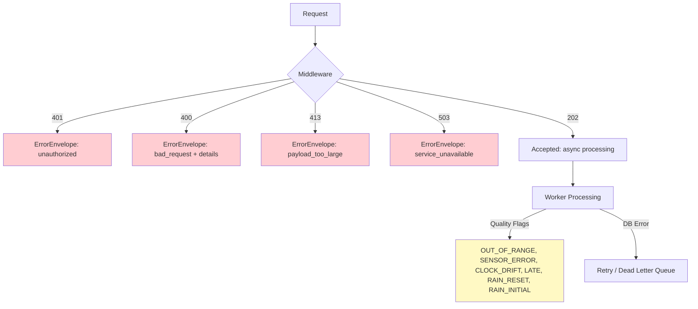

# Data Flow Diagram — Bagian D

## Sensor → Frontend Alur Data (Sequence / Flowchart)

```mermaid
sequenceDiagram
    autonumber
    actor Sensor as "Sensor Hardware"
    participant Firmware as "Device Firmware"
    participant Transport as "HTTPS/HTTP"
    participant Gateway as "API Gateway / Nginx"
    participant Auth as "AuthenticateApiKey Middleware"
    participant Validator as "JsonParser (Structural Validation)"
    participant Normalizer as "IngestController (Normalization & Dedup)"
    participant Queue as "RabbitMQ (telemetry.ingest)"
    participant Worker as "ProcessTelemetryReading Job"
    participant Processor as "TelemetryProcessor (Enrichment)"
    participant DB as "PostgreSQL + TimescaleDB"
    participant Aggregator as "AggregateRecalculator (Scheduler)"
    participant API as "Read API (/readings, /dashboard)"
    participant Frontend as "Next.js Dashboard"

    Sensor->>Firmware: Raw reading (per detik/menit)
    Firmware->>Firmware: Buffer di RAM/flash (ring buffer)
    alt Online
        Firmware->>Transport: POST /api/v1/ingest/telemetry/batch\nX-API-Key, payload F.1
    else Offline
        Firmware->>Firmware: Simpan lokal, kirim saat online
    end

    Transport->>Gateway: Forward request
    Gateway->>Auth: Middleware chain
    Auth->>DB: SELECT device_credentials WHERE api_key = ?
    alt Key valid
        Auth->>Auth: Attach Device model ke request
    else Key invalid/missing
        Auth-->>Gateway: 401 Unauthorized
        Gateway-->>Firmware: 401 + ErrorEnvelope
    end

    Auth->>Validator: Parse & normalisasi payload F.1\n(single/batch/heartbeat)
    Validator->>Validator: Validasi struktural:\n- required fields (device_id, fw, ts, seq, battery_v, rssi, readings[])\n- enum sensor code (temp_air, humidity, pressure, wind_speed, wind_dir, rain_counter, solar_rad)\n- tipe data (number, integer)
    alt Valid
        Validator->>Normalizer: Payload ternormalisasi
    else Invalid
        Validator-->>Gateway: 400 Bad Request + ErrorEnvelope
        Gateway-->>Firmware: 400
    end

    Normalizer->>Normalizer: Cek idempotensi best-effort\nSELECT reading_key FROM sensor_readings
    Normalizer->>Normalizer: Chunk batch > 100 → multiple jobs (max 100/job)
    Normalizer->>Queue: Dispatch ProcessTelemetryReading job(s)
    Queue-->>Gateway: 202 Accepted + response body (accepted/duplicates/items)
    Gateway-->>Firmware: 202

    Worker->>Queue: Consume job (prefetch=1)
    Worker->>Processor: ProcessTelemetryReading::handle()
    Processor->>DB: Lookup sensor terpasang + kalibrasi efektif\n(sensor_installations + sensor_calibrations WHERE effective_from <= device_time)
    Processor->>Processor: Rain delta:\n- Ambil rainBaseline (last raw_value < min_ts batch)\n- delta = (counter_baru - counter_lama) * 0.2 mm\n- Handle reset (counter turun) → RAIN_RESET, 0 mm\n- First ever → RAIN_INITIAL, 0 mm
    Processor->>Processor: Kalibrasi: corrected = raw * scale + offset
    Processor->>Processor: Quality flag:\n- GOOD, OUT_OF_RANGE (valid_min/max), SENSOR_ERROR (-999),\n  CLOCK_DRIFT (device_time > now+5min), LATE (device_time < now-1h),\n  INVALID, DUPLICATE
    Processor->>DB: INSERT sensor_readings (ON CONFLICT reading_key DO NOTHING)\npg_advisory_xact_lock(device_id) untuk serialisasi rain delta
    Processor->>DB: UPDATE device_health (battery_v, rssi, fw, seq, last_heartbeat_at)\nUPDATE devices (last_seen_at, last_device_time)
    Worker->>Queue: Ack job

    par Background Aggregation (every 5 min)
        Aggregator->>DB: Recalculate reading_aggregates (1m, 1h, 1d)\nFROM sensor_readings WHERE quality_flag = 'GOOD'\nUPSERT ON CONFLICT (sensor_id, interval, bucket_start)
    end

    Frontend->>API: GET /api/v1/readings?device_id=&sensor_type=&from=&to=&interval=1h
    API->>DB: Query reading_aggregates (preferred) atau sensor_readings (raw)
    DB-->>API: Columnar JSON (bucket_start, min, max, avg, sum, count, quality_count)
    API-->>Frontend: 200 + columnar payload

    Frontend->>Frontend: Render Recharts (line/bar), polling 30s, WIB timezone
```



---

## Flowchart Overview (Simplified)

```mermaid
flowchart TD
    A[Sensor Hardware] --> B[Firmware Buffer]
    B --> C{Online?}
    C -->|Yes| D[POST /ingest/telemetry/batch\nX-API-Key]
    C -->|No| B
    D --> E[Nginx / API Gateway]
    E --> F[AuthenticateApiKey Middleware]
    F --> G{Valid API Key?}
    G -->|No| H[401 Unauthorized]
    G -->|Yes| I[JsonParser: Structural Validation]
    I --> J{Valid Payload?}
    J -->|No| K[400 Bad Request]
    J -->|Yes| L[IngestController: Normalize + Dedup + Chunk]
    L --> M[RabbitMQ: telemetry.ingest queue]
    M --> N[Worker: ProcessTelemetryReading]
    N --> O[TelemetryProcessor]
    O --> P[Lookup Installations + Calibrations]
    O --> Q[Rain Delta Calculation]
    O --> R[Calibration: corrected = raw*scale + offset]
    O --> S[Quality Flag Assignment]
    O --> T[INSERT sensor_readings\nON CONFLICT DO NOTHING]
    O --> U[UPDATE device_health + devices]
    N --> V[Ack Job]

    T --> W[(PostgreSQL + TimescaleDB)]
    U --> W

    W --> X[AggregateRecalculator\n(cron 5 menit)]
    X --> Y[UPSERT reading_aggregates\n1m/1h/1d from GOOD readings]

    Z[Frontend Dashboard] --> AA[GET /api/v1/readings\n/dashboard]
    AA --> W
    Y --> W
    W --> AA
    AA --> Z

    style W fill:#e1f5fe
    style M fill:#fff3e0
    style N fill:#f3e5f5
    style Z fill:#e8f5e9
```

---

## Component Responsibilities

| Stage | Component | Key Responsibility |
|-------|-----------|-------------------|
| **Ingest** | Firmware | Buffer offline, batch send, include `seq` for ordering |
| **Transport** | HTTPS + Nginx | TLS termination, rate limiting, request routing |
| **Auth** | `AuthenticateApiKey` | Validate `X-API-Key` → `device_credentials`, attach `Device` |
| **Validate** | `JsonParser` | Structural validation only (required fields, enums, types); **no range checks** |
| **Normalize** | `IngestController` | Build `reading_key`, chunk >100, best-effort dedup, dispatch to queue |
| **Queue** | RabbitMQ | `telemetry.ingest` queue, publisher confirms, prefetch=1 |
| **Process** | Worker + `TelemetryProcessor` | Core enrichment: calibration, rain delta, quality flags, DB insert |
| **Store** | PostgreSQL + TimescaleDB | `sensor_readings` (hypertable, 7-day chunks), `device_health`, `devices` |
| **Aggregate** | `AggregateRecalculator` (scheduler) | Rebuild `reading_aggregates` 1m/1h/1d from `GOOD` readings, upsert |
| **Serve** | Read API | Columnar JSON from `reading_aggregates` (preferred) or `sensor_readings` |
| **Display** | Next.js + Recharts | Polling 30s, WIB timezone, gap handling (`connectNulls=false`) |

---

## Idempotency & Race Condition Guards

```mermaid
flowchart LR
    A[Firmware Retry] --> B[reading_key = device_id|epoch_us|sensor_id|seq]
    B --> C{INSERT sensor_readings\nON CONFLICT (reading_key, device_time) DO NOTHING}
    C -->|Success| D[1 row stored]
    C -->|Conflict| E[Duplicate ignored]
    
    F[Concurrent Workers] --> G[pg_advisory_xact_lock(hashtext(device_id))]
    G --> H[Serial rain delta per device]
    H --> I[Correct baseline for rain_counter]
```

---

## Data Formats at Each Stage

| Stage | Format |
|-------|--------|
| Firmware → API | JSON F.1: `{device_id, fw, ts, seq, battery_v, rssi, readings:[{s,v}]}` |
| Queue Message | Laravel job payload (serialized `ProcessTelemetryReading` data) |
| DB `sensor_readings` | Narrow: 1 row per sensor per timestamp (`raw_value`, `corrected_value`, `quality_flag`) |
| DB `reading_aggregates` | Pre-computed: `min/max/avg/sum/count` per sensor per bucket (1m/1h/1d) |
| API → Frontend | Columnar JSON: `{columns:[...], data:[[...],[...]]}` |
| Frontend Chart | Recharts `LineChart`/`BarChart` with `connectNulls=false` |

---

## Error Handling Flow



---

## Key Design Decisions in Flow

1. **Async Ingestion** → 202 Accepted, worker processes via queue (decouples device from DB load)
2. **Quality Flags over Rejection** → Invalid sensor values stored with flags, not rejected (forensic integrity)
3. **Narrow Schema** → 1 row per sensor enables extensibility without migrations
4. **Rain Counter Delta** → Computed in worker with advisory lock (handles reset/restart correctly)
5. **Calibration by Period** → `effective_from/to` allows historical recalculation
6. **Aggregates Separate** → `reading_aggregates` for fast dashboard queries, recomputed every 5 min (self-healing)
7. **Columnar API Response** → ~40% smaller payload vs array of objects
8. **WIB Frontend** → DB stores UTC, frontend forces Asia/Jakarta via `Intl.DateTimeFormat`